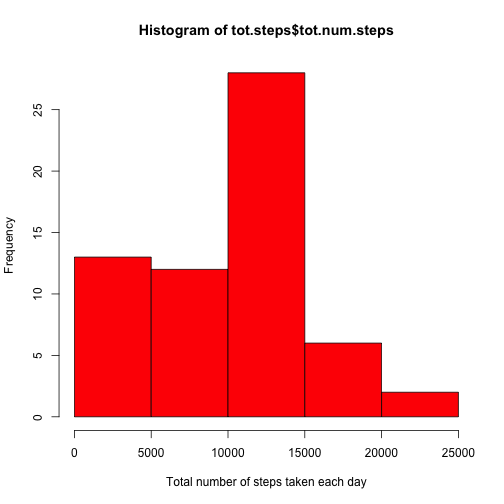
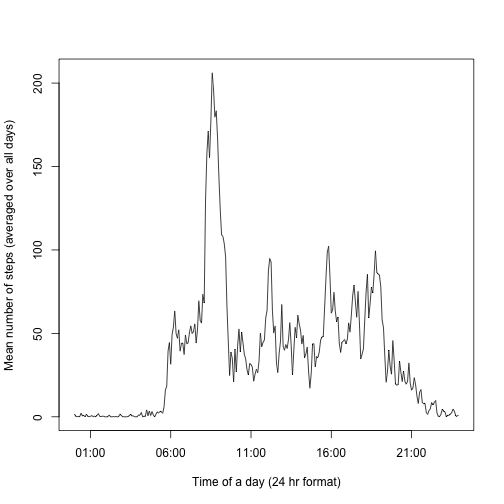
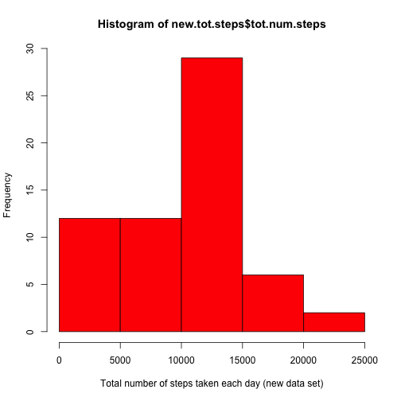
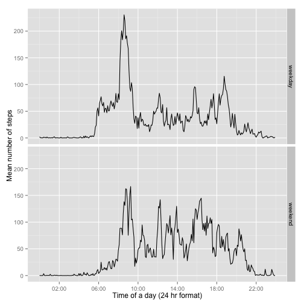

This is a report for assignment 1.

Load R packages needed for our analysis.

```r
library(dplyr)
library(knitr)
```

Load data.  

```r
df <- read.csv("activity.csv",na.strings="NA")
```

Explore the data.

```r
names(df)
```

```
## [1] "steps"    "date"     "interval"
```

```r
summary(df)
```

```
##      steps                date          interval     
##  Min.   :  0.00   2012-10-01:  288   Min.   :   0.0  
##  1st Qu.:  0.00   2012-10-02:  288   1st Qu.: 588.8  
##  Median :  0.00   2012-10-03:  288   Median :1177.5  
##  Mean   : 37.38   2012-10-04:  288   Mean   :1177.5  
##  3rd Qu.: 12.00   2012-10-05:  288   3rd Qu.:1766.2  
##  Max.   :806.00   2012-10-06:  288   Max.   :2355.0  
##  NA's   :2304     (Other)   :15840
```

### What is mean total number of steps taken per day?
1. Calculate the total number of steps taken per day

```r
tot.steps <- df %>% group_by(date) %>% summarise(sum(steps,na.rm=TRUE))
names(tot.steps) <- c("date","tot.num.steps")
```

2. Make a histogram of the total number of steps taken each day

```r
hist(tot.steps$tot.num.steps,col="red", xlab="Total number of steps taken each day")
```

 

3. The mean and median of the total number of steps taken per day

```r
mean(tot.steps$tot.num.steps) # mean
```

```
## [1] 9354.23
```

```r
median(tot.steps$tot.num.steps) # median
```

```
## [1] 10395
```

### What is the average daily activity pattern?
1. The average number of steps taken (y-axis) vs 5-min interval (x-axis)

```r
ave.steps <- df %>% group_by(interval) %>% summarise(mean(steps,na.rm=TRUE))
# convert interval into datetime format
ave.steps$true.time <- strptime(lapply(ave.steps$interval,
                                      function(t) formatC(t,width=4,flag="0")),
                               format("%H%M"))
names(ave.steps) <- c("interval","mean.num.steps","true.time")
plot(ave.steps$true.time,ave.steps$mean.num.steps,type="l",
     xlab="Time of a day (24 hr format)",ylab="Mean number of steps (averaged over all days)")
```

 

2. The 5-minute interval, on average across all the days in the dataset, that contains the maximum number of steps

```r
format(ave.steps[which.max(ave.steps$mean.num.steps),]$true.time,"%H:%M")
```

```
## [1] "08:35"
```

### Imputing missing values
1. The total number of missing values in the dataset

```r
missing <- is.na(df$steps) # reuse later
sum(missing)
```

```
## [1] 2304
```

2. Strategy to fill in missing valus. Use the mean of the 5-min interval.
3. Create a new dataset that is equal to the original dataset but with the missing data filled in.

```r
# as.integer is important here, because x could be treated as strings
replacer <- function(x){
  ave.steps[ave.steps$interval==as.integer(x),]$mean.num.steps
}
newdf <- df # new data set with missing data filled in
# there is a mixing of data type 
# (originally steps are integer, replacer will produce mean as strings)
# hence it is important to use as.numeric to recast data into float
newdf$steps <- as.numeric(apply(newdf, 1, 
                                function(x) ifelse(is.na(x[1]),replacer(x[3]),x[1])))
```

4. A histogram of the total number of steps taken each day, plus the mean and median of the total number of steps taken per day.

```r
new.tot.steps <- newdf %>% group_by(date) %>% summarise(sum(steps,na.rm=TRUE))
names(new.tot.steps) <- c("date","tot.num.steps")
hist(new.tot.steps$tot.num.steps,col="red", xlab="Total number of steps taken each day (new data set)") # histogram
```

 

```r
mean(new.tot.steps$tot.num.steps) # mean
```

```
## [1] 10766.19
```

```r
median(new.tot.steps$tot.num.steps) # median
```

```
## [1] 10766.19
```
Both the mean and median of the total daily number of steps have increased after imputing the missing data.

### Are there differences in activity patterns between weekdays and weekends?
1. Create a new factor variable (day) in the dataset with two levels -- "weekday" and "weekend"

```r
weekend = c("Saturday","Sunday")
newdf$day <- factor(ifelse(weekdays(as.Date(newdf$date)) %in% weekend,
                           "weekend","weekday") )
```

2. The average number of steps taken (y-axis) vs 5-min interval (x-axis), averaged across either all weekday days or all weekend days.

```r
day.ave.steps <- newdf %>% group_by(day,interval) %>% summarise(mean(steps,na.rm=TRUE))
# convert interval into datetime format
day.ave.steps$true.time <- as.POSIXct(strptime(lapply(day.ave.steps$interval,
                                           function(t) formatC(t,width=4,flag="0")),
                                           format("%H%M")),format="%H:%M")
names(day.ave.steps) <- c("day","interval","mean.num.steps","true.time")

library(ggplot2)
library(scales)
g <- ggplot(day.ave.steps,aes(true.time,mean.num.steps))
g + geom_line(stat="identity") + facet_grid( day ~.) + 
    scale_x_datetime(breaks=date_breaks('4 hour'), 
                     labels=date_format('%H:%M')) +
    labs(x="Time of a day (24 hr format)") +
    labs(y="Mean number of steps")
```

 

There is a difference between weekday and weekend activity pattern. 

For weekday, there is a greater activity in the early morning (8am to 10am). 

For weekend, the activity is more uniform during the day time.
